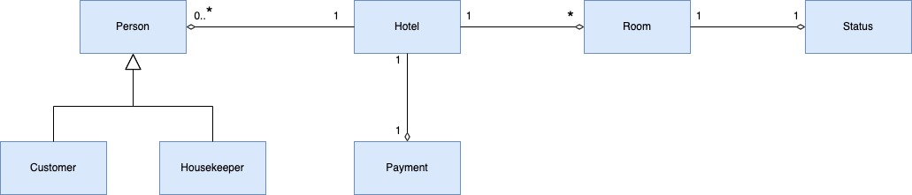
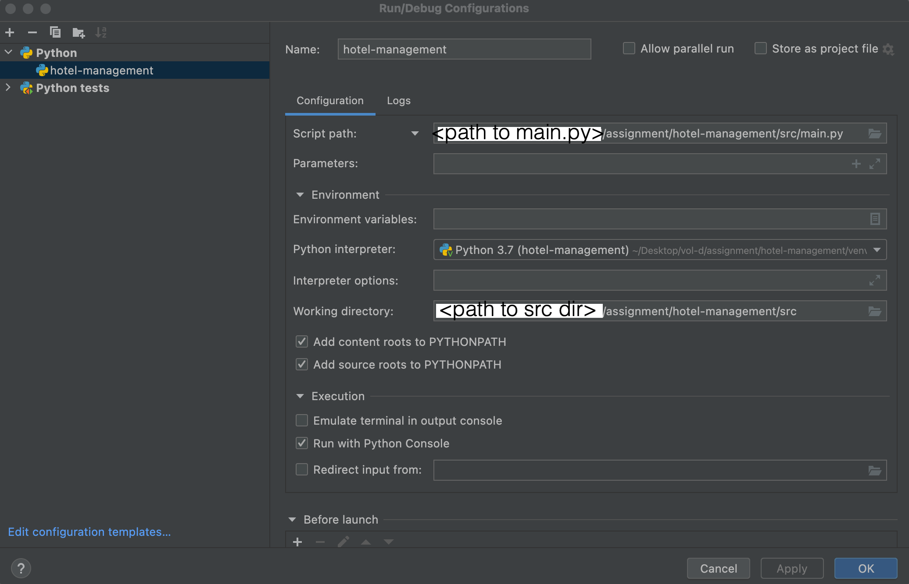
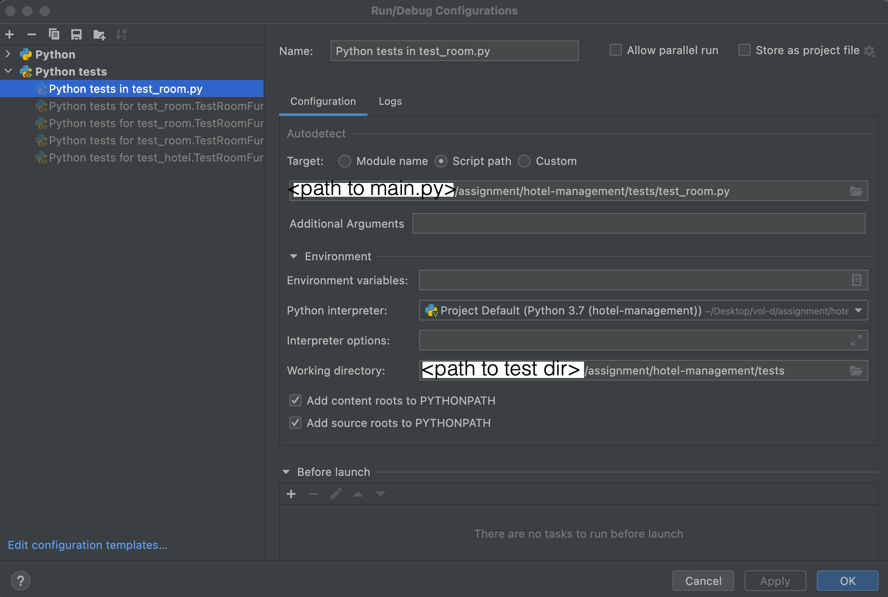
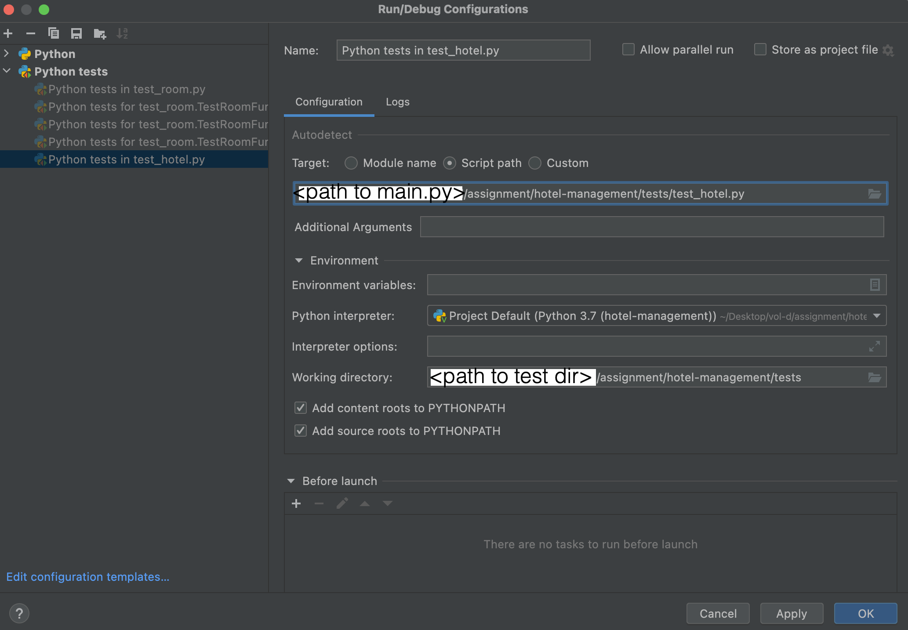

## hotel-management

### Class diagram

### How to compile & run

1. Import this project in pycharm.
2. To Run application Add new config as below:

3. Execute application by clicking :arrow_forward: 
4. Alternatively you can run "run.sh" in shell command prompt. 
   1. export correct project path in run.sh script.
   2. execute `./run.sh`

### How to run tests
1. Import this project in pycharm.
2. To Run test Add new config as below:

Thanks!

